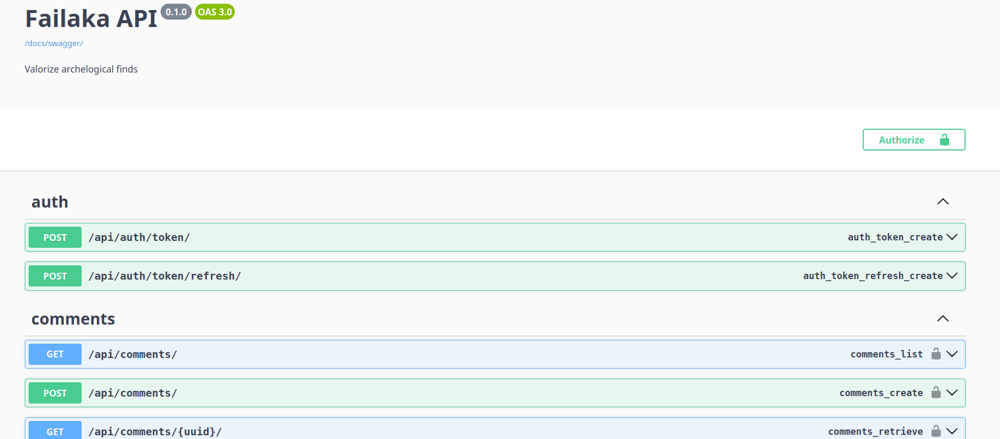

# 🏺 Failaka Archaeological Archives  
Digital archiving and public valorization of archaeological resources from the Failaka excavation site, Kuwait.


---

## 📖 Overview

This project is a digital archive and valorization platform for the archaeological site of **Failaka**, located in Kuwait. It aims to centralize, preserve, and provide structured access to historical data, excavation reports, images, and metadata.

The platform consists of:
- A backend API to manage and serve archaeological data
- A web frontend (under construction) for researchers and the general public

---

## 🖥️ Demo

> 📷 *Screenshot*  


- 🧩 **API documentation**: [https://failaka.evendev.net/docs/swagger-ui/](https://failaka.evendev.net/docs/swagger-ui/)
- 🌐 **Frontend app** *(in progress)*: [https://failaka.evendev.net/](https://failaka.evendev.net/)

---

## ⚙️ Installation

This is a standard Django-based backend API. To run locally:

```bash
# Clone the repository
git clone https://github.com/DaGuinci/failaka
cd failaka-archives

# (Recommended) Create and activate a virtual environment
python -m venv env
source env/bin/activate

# Install dependencies
pip install -r requirements.txt

# Set up the database (PostgreSQL)
createdb failaka
python manage.py migrate

# Create a superuser
python manage.py createsuperuser

# Run the development server
python manage.py runserver
```

Make sure to configure your `.env` file or Django settings for PostgreSQL access and JWT secret keys.

---

## 💡 Technologies Used

- 🐍 **Python**
- 🧱 **Django** (4.x)
- 🔗 **Django REST Framework (DRF)**
- 🔐 **JWT Authentication**
- 📄 **Swagger UI** (via `drf-spectacular`)
- 📚 **Sphinx** (for internal project documentation)
- 🗄️ **PostgreSQL** (database)
- 🐳 **Docker** (containerized development & deployment)
- 🚀 **CI/CD** with **GitHub Actions**

---

## 👤 About the Developer

<div align="center">
  <p>Developed by <a href="https://evendev.net"><strong>Guillaume Even</strong></a></p>
  <a href="https://evendev.net">
    
  </a>
</div>