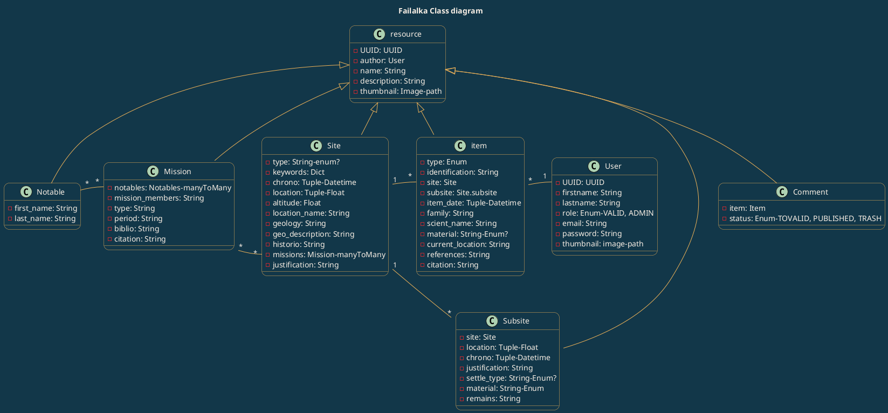

<!--

```plantuml
@startuml
skinparam backgroundColor #123749
skinparam roundcorner 20
skinparam classfontcolor lemon chiffon
skinparam titlefontcolor linen
skinparam arrowfontcolor linen
skinparam attributefontcolor linen

skinparam class {
BackgroundColor #123749
ArrowColor #EEB258
BorderColor #EEB258
AttributeFontColor linen
}
' skinparam handwritten true
title Failalka Class diagram

class resource {
  - UUID: UUID
  - author: User
  - name: String
  - description: String
  - thumbnail: Image-path
}

class item extends resource {
  - type: Enum
  - identification: String
  - site: Site
  - subsite: Site.subsite
  - item_date: Tuple-Datetime
  - family: String
  - scient_name: String
  - material: String-Enum?
  - current_location: String
  - references: String
  - citation: String
}

class Site extends resource {
  - type: String-enum?
  - keywords: Dict
  - chrono: Tuple-Datetime
  - location: Tuple-Float
  - altitude: Float
  - location_name: String
  - geology: String
  - geo_description: String
  - historio: String
  - missions: Mission-manyToMany
  - justification: String
}

class Subsite extends resource {
  - site: Site
  - location: Tuple-Float
  - chrono: Tuple-Datetime
  - justification: String
  - settle_type: String-Enum?
  - material: String-Enum
  - remains: String
}

class Mission extends resource {
  - notables: Notables-manyToMany
  - mission_members: String
  - type: String
  - period: String
  - biblio: String
  - citation: String
}

class Notable extends resource {
  - first_name: String
  - last_name: String
}

class User {
  - UUID: UUID
  - firstname: String
  - lastname: String
  - role: Enum-VALID, ADMIN
  - email: String
  - password: String
  - thumbnail: image-path
}

class Comment extends resource {
  - item: Item
  - status: Enum-TOVALID, PUBLISHED, TRASH
}

item::author "*" -r- "1" User::UUID
item::site "*" -l- "1" Site::UUID
Site::subsites "1" -- "*" Subsite::UUID
Site::missions "*" -l- "*" Mission::UUID
Mission::notables "*" -l- "*" Notable
@enduml
```
-->