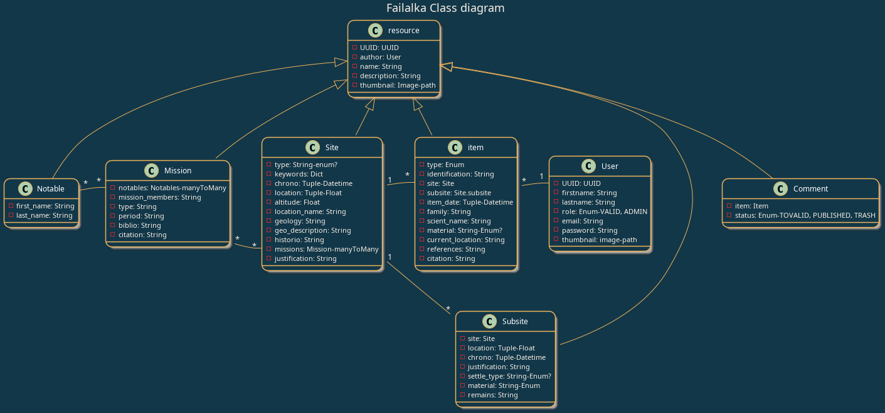

===========
Development
===========

Context
-------

Backup and Enhancement of the Failalka Mission items.

Inspired by [this website](https://desertnetworks.huma-num.fr/)

User stories
------------

* As a user, I want to see a list of items, so I can navigate randomly;
* As a user, I want to get more information about a resource, so I can go further in my investigation;
* As a user, I can get list of resources with filters such as type, subsite or date;
* As a user, I can submit a comment referring to an item;
* As a user, I can order a list of item in better resolution;
* As a validator, I can add a resource;
* As a validator, I can modify one of my resources;
* As a validator, I can modify any resource;
* As a validator, I receive comment submissions and can accept or reject them;
* As an administrator, I can add, modify or delete any resource.

* un lecteur peut soumettre un comment
* les validateurs en sont informés
* les validateur valident la publi du comm
* Un lecteur peut stocker une selection d'articles pour faire une demande de dl en meilleur resolution

Class diagram
----------------
The class diagram below shows the main classes and their relationships in the project.
It is a simplified representation of the project's structure and is intended to provide a high-level overview of the system.

.. note:: The class diagram is generated using PlantUML and is included in the documentation for reference.

Class tables
----------------

.. list-table:: Class Overview
   :header-rows: 1

   * - Class Name
     - Attributes
   * - User
     - | UUID: UUID
       | firstname: String
       | lastname: String
       | role: Enum (VALID, ADMIN)
       | email: String
       | password: String
       | thumbnail: image
   * - resource
     - | UUID: UUID
       | author: User
       | name: String
       | description: String
       | thumbnail: image
   * - item (extends resource)
     - | UUID: UUID
       | author: User
       | name: String
       | description: String
       | type: Enum
       | identification: String
       | site: Site
       | subsite: Site.subsite
       | item_date: Tuple(Datetime)
       | family: String
       | scient_name: String
       | material: String (Enum?)
       | current_location: String
       | references: String
       | citation: String
       | method1(): ReturnType
   * - Site (extends resource)
     - | UUID: UUID
       | author: User
       | name: String
       | description: String
       | type: String (enum?)
       | keywords: Dict
       | chrono: Tuple(Datetime)
       | location: Tuple(Float)
       | altitude: Float
       | location_name: String
       | geology: String
       | geo_description: String
       | historio: String
       | missions: Mission
       | justification: String
       | method1(): ReturnType
   * - Subsite (extends resource)
     - | UUID: UUID
       | author: User
       | name: String
       | description: String
       | site: Site
       | location: Tuple(Float)
       | chrono: Tuple(Datetime)
       | justification: String
       | settle_type: String (Enum?)
       | material: String(Enum)
       | remains: String
   * - Mission (extends resource)
     - | UUID: UUID
       | author: User
       | name: String
       | description: String
       | notables: MissionMember
       | mission_members: String
       | type: String
       | period: String
       | biblio: String
       | citation: String
       | method1(): ReturnType
   * - Notable (extends resource)
     - | UUID: UUID
       | author: User
       | name: String
       | description: String
       | first_name: String
       | last_name: String
   * - Comment (extends resource)
     - | UUID: UUID
       | author: User
       | name: String
       | description: String
       | item: Item
       | status: Enum (TOVALID, PUBLISHED, TRASH)

Permissions
----------------

.. list-table:: Permissions Overview
   :header-rows: 1

   * - Resource
     - Role
     - Create
     - Read
     - Update any
     - Update own
     - Delete any
     - Delete own
   * - User
     - | User
       | validator
       | admin
     - | ✔
       | ✔
       | ✔
     - | 
       | ✔
       | ✔
     - | 
       | 
       | ✔
     - | ✔
       | ✔
       | ✔
     - | 
       | 
       | ✔
     - | ✔
       | ✔
       | ✔
   * - | Resource
       | (Item, Site,
       | subsite,
       | mission,
       | notable)
     - | User
       | validator
       | admin
     - | 
       | ✔
       | ✔
     - | ✔
       | ✔
       | ✔
     - | 
       | ✔
       | ✔
     - | 
       | ✔
       | ✔
     - | 
       | ✔
       | ✔
     - | 
       | ✔
       | ✔
   * - Comment
     - | User
       | validator
       | admin
     - | ✔
       | ✔
       | ✔
     - | ✔
       | ✔
       | ✔
     - | 
       | ✔
       | ✔
     - | ✔
       | ✔
       | ✔
     - | 
       | ✔
       | ✔
     - | ✔
       | ✔
       | ✔

Local installation
------------------

1. Prerequisites

Have a database installed on your machine (PostgreSQL, MySQL, SQLite, etc.)

2. Clone git repertory

.. code-block:: bash

    git clone https://github.com/DaGuinci/failalka.git

3. Virtual environment creation

.. code-block:: bash

    cd Orange-County-Lettings
    python -m venv env

* Activate

.. code-block:: bash

    source env/bin/activate

4. Install dependencies

.. code-block:: bash

    pip install -r requirements.txt

5. Create a `.env` file at the root of the project with the following content:

.. code-block:: bash

    DJANGO_ENV='development'
    SECRET='your_secret_key'
    DJANGO_SUPERUSER_USERNAME='superadmin'
    DJANGO_SUPERUSER_PASSWORD='superadmin'
    DJANGO_SUPERUSER_EMAIL='your_email'

6. Run the migrations

.. code-block:: bash

    python manage.py migrate

7. Run the server

.. code-block:: bash

    python manage.py runserver

8. Open your browser and go to the following address:

``http://localhost:8000``

9. Useful commands

To launch the server:

.. code-block:: bash

    python manage.py runserver

To launch tests suite:

.. code-block:: bash

    python manage.py test

To reboot the database (DELETE ALL DATAS):

.. code-block:: bash
    
    python manage.py flush
    python manage.py loaddata initial_data.json
