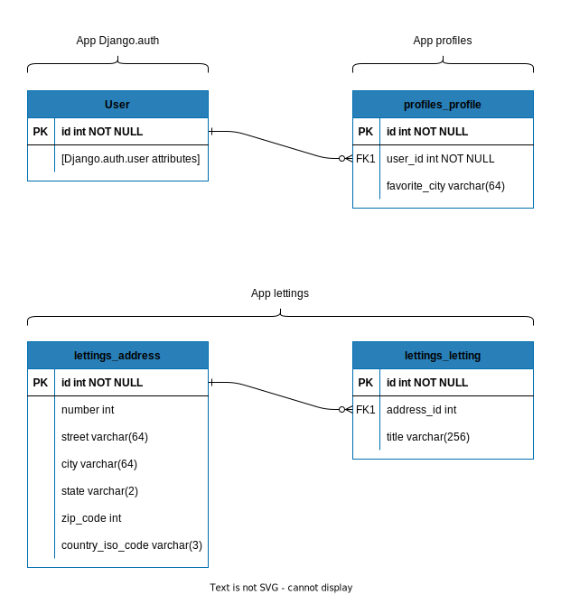

=======================
Environnement technique
=======================

Langages utilisés
-----------------

Si on exclut les fichiers templates en **HTML** et feuilles de style en **CSS**, ainsi que les
fichiers de configuration de CircleCi et Docker, l'ensemble du site est codé en **Python**.

La documentation est écrite en **ReStructuredText**, compilée à l'aide
de `Sphinx <https://www.sphinx-doc.org/en/master/>`_.

Le diagramme de classe de la présente page est écrit en PlantUml. (cf `PlantUml <https://plantuml.com/fr/>`_)

Structure des fichiers
----------------------

Le site, basé sur Django, **contient trois apps:**

.. code-block:: bash

   oc-lettings-site
   ├── app:home
   │   └── views.py
   │       ├── index
   │       ├── custom_404
   │       ├── custom_500
   │       └── error_generating
   ├── app:profiles
   │   ├── models.py
   │   │   └── Profile
   │   └── views.py
   │       ├── index
   │       └── profile
   ├── app:lettings
   │   ├── models.py
   │   │   ├── Address
   │   │   └── Letting
   │   └── views.py
   │       ├── index
   │       └── letting
   ├── config:oc_lettings_site
       └── settings.py

Structure de la base de données
-------------------------------

.. warning::

    Dans l'attente de nouvelles instructions,
    la **base de données, en sqlite, est versionnée**.

    Prenez donc en considération que les modifications sur la base
    auront un impact sur les bases des collaborateurs
    et celle de la production, en cas de push.

Diagramme de classe
^^^^^^^^^^^^^^^^^^^

.. uml::

    @startuml
    skinparam backgroundColor #fff
    skinparam roundcorner 20
    skinparam classfontcolor lemon chiffon
    skinparam titlefontcolor black
    skinparam arrowfontcolor black
    skinparam attributefontcolor linen

    skinparam class {
    BackgroundColor #2980b9
    ArrowColor #EEB258
    BorderColor #EEB258
    AttributeFontColor linen
    }
    ' skinparam handwritten true
    class Profile {
    - user: User
    - favorite_city: str
    }

    class Letting {
    - titles: str
    - address: Address
    }

    class Address {
    - number: int
    - street: str
    - city: str
    - state: str
    - zip_code: int
    - country_iso_code: str
    }

    Letting "1" -- "1" Address
    @enduml

Schéma de la base de données
^^^^^^^^^^^^^^^^^^^^^^^^^^^^

Interfaces de programmation
---------------------------

    * Sentry

    Sentry est utilisé pour logguer les messages d'erreurs.

    * Docker Hub

    Les images Docker sont stockées et accessibles via Docker Hub.

    * CircleCi

    CircleCi est le gestionnaire des pipelines et du déploiement.
    Les tâches y sont automatisées et se déclenchent pour chaque nouveau commit
    sur le dépôt Github.

    La configuration du projet sur CircleCi est la suivante:

        * Toute branche:

            + Exécution de la suite de tests (un taux de couverture 80% est nécessaire
              pour obtenir la réussite de cette suite de tests)

        * Branche dev:

            + Exécution de la suite de tests
            + Création d'une image docker
            + Envoi de l'image docker au dépôt Docker Hub en tant que latest

        * Branche master:

            + Exécution de la suite de tests
            + Création d'une image docker
            + Déploiement de l'image docker sur Render pour mise en ligne

    * Render

    Render est l'hébergeur utilisé pour la production.

    * ReadTheDocs

    La documentation du site est gérée par ReadTheDocs.

    Deux versions sont disponibles:

        * https://daguinci-orange-county-lettings.readthedocs.io/fr/dev/
        * https://daguinci-orange-county-lettings.readthedocs.io/fr/latest/

    Ces deux versions sont automatiquement mises à jour à chaque commit reçu par Git Hub,
    respectivement sur la branche dev et sur la branche master.